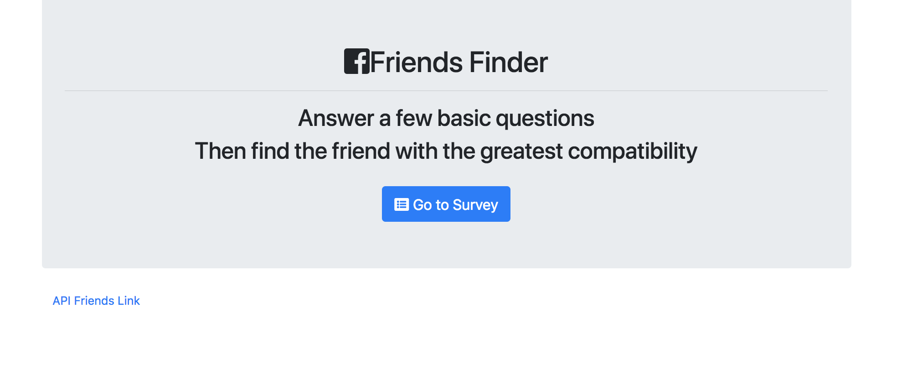
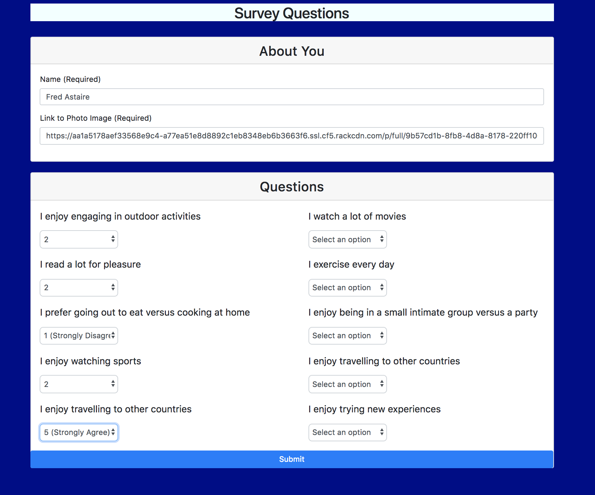
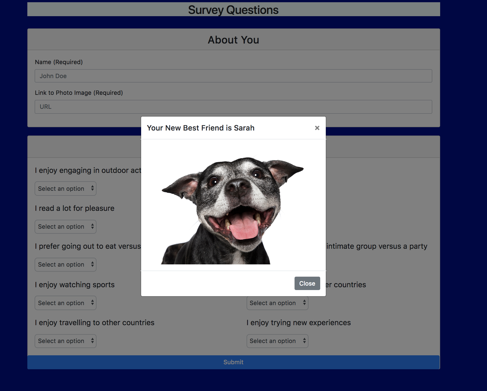

# FriendFinder

This application has a node express backend hosted on Heroku which does "Tinder-style" matching of friends.

## Description 

The idea of this application is that friend matches are more likely to be found between people who have like interests.  This application keeps an internal database of survey data.  When the user submits their surveys, the application combs the database and finds a past user in the database that has the most common with you (technically, the least differences) and shows you that users name and picture.  It then adds your survey data so you can be matched with future users.

### Usage instructions

This application has 3 URLs:

    * `/` - Home page
    * `/survey`- Survey page
    * `/api/survey`- API page which shows JSON contents of the full user database

This is the main page.  The user can get to the survey by clicking on "Go to Survey".  At the bottom of the page, there is also a link to the /api/survey page.

This is the survey page.  All the fields are mandatory.  The user will add their data and submit their answers.

Once the survey is submitted, the application will match the users answers against records in its database and show the user their best friend match.  The application will then add this new user's record to the database.

If the user has an interest in seeing the contents of the database, they can click on the "API Friends Link" on the home page or go to the /app/survey/ link directly.  This will display the JSON for all of the records in the database.

